# Architecture Overview

RedisSMQ is a message queue built on Redis. This document explains the system design and how components interact using the [C4 model](https://c4model.com/). All diagrams are language‑agnostic and apply to every implementation.

---

## System Components

### 1. System Context (Level 1)

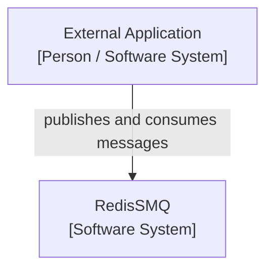

**Scope:** The RedisSMQ system and the external applications that interact with it.

---

### 2. Container Diagram (Level 2)

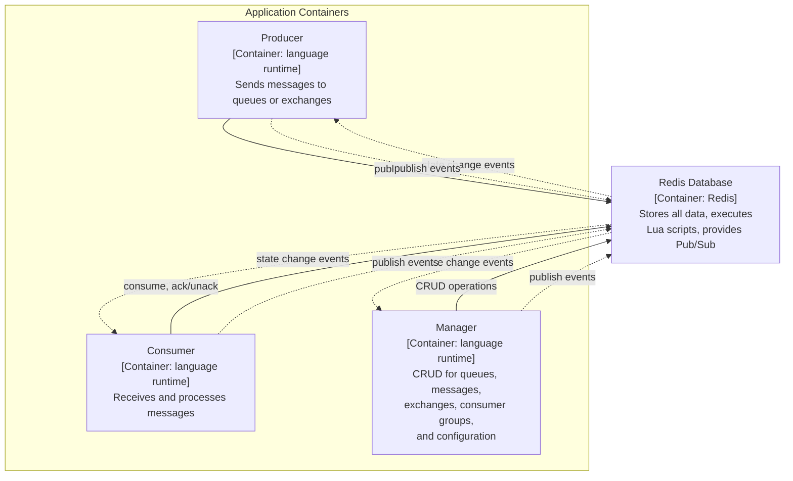

> **Note:** Event Bus is Redis Pub/Sub, a built‑in capability of Redis. It is not a separate deployable container.

---

### 3. System Components

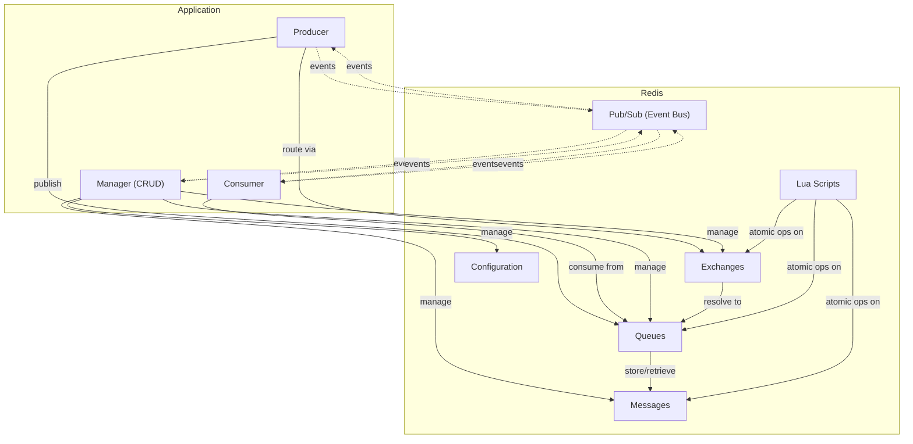

---

### 4. Component Diagrams (Level 3)

#### Producer Container – Publishing Flow

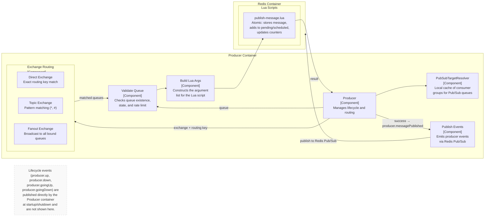

#### Consumer Container – Message Handling & Background Workers

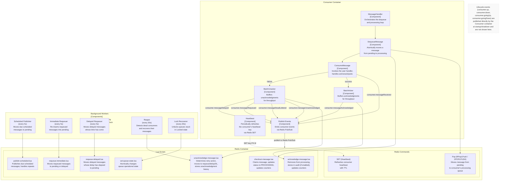

#### Management Components

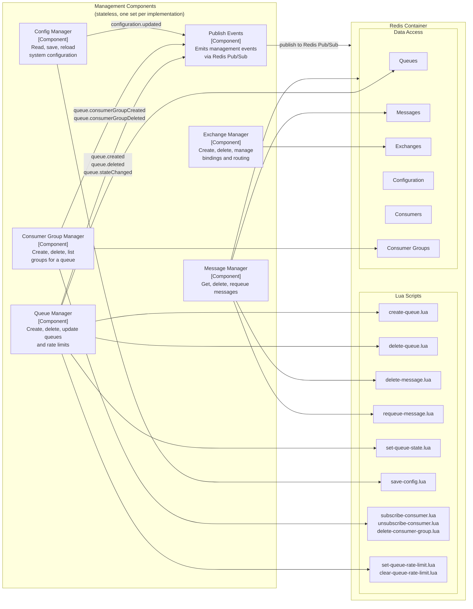

The management layer is split into specialised managers, each responsible for a single domain (queues, messages, exchanges, consumer groups, configuration). 

Every implementation provides its own set of managers that share the same underlying Redis schema and Lua scripts. 

Managers publish events when resources are created, modified, or deleted, enabling real‑time cross‑instance synchronisation.

#### Redis Container – Data Structures

```mermaid
flowchart LR
    subgraph Queue["Queue: ns:{namespace}:q:{name}"]
        direction TB
        Prop["prop (Hash) – metadata\n(type, delivery model,\ncounters, state, lock ID,\nrate limit)"]
        Pub["pub (List) – all message IDs"]
        Pend["pend (List/ZSet) – waiting\nfor consumer"]
        Prio["prio (ZSet) – priority pending"]
        Proc["cons:{consumerId}:proc (List)\n– in‑flight messages per consumer"]
        Sched["sched (ZSet) – future delivery\ntimestamps"]
        Ack["ack (List) – successfully\nprocessed (audit)"]
        DL["dl (List) – permanently\nfailed (audit)"]
        Delay["dly (ZSet) – waiting for\nretry delay"]
        Req["req (List) – waiting for\nre‑insertion into pending"]
        Cons["cons (Hash) – consumer info\n(JSON: ip, hostname, pid,\ncreatedAt)"]
        CG["cgp (Set) – consumer\ngroup IDs"]
        CGProc["cgp:{groupId}:pend (List)\n– group pending"]
        CGPrio["cgp:{groupId}:prio (ZSet)\n– group priority"]
        CGMemb["cgp:{groupId}:cons (Set)\n– group members"]
        ProcQ["proc‑q (Hash) – maps processing\nqueue key → consumer ID"]
        State["sh (List) – state transition log\n(from, to, reason, timestamp)"]
        Bind["bind (Set) – exchange names\nbound to this queue"]
        WLock["wlock (String) – distributed\nworker lock"]
        Rate["rate (String) – rate limit\ncounter"]
    end

    subgraph Exchange["Exchange: ns:{namespace}:exs:{name}"]
        direction TB
        ExProp["prop (Hash) – type, policy"]
        Direct["rk (Set) – routing keys"]
        DirectQ["rk:{key}:q (Set) – queues\nper routing key"]
        Topic["pat (Set) – binding patterns"]
        TopicQ["pat:{pattern}:q (Set) – queues\nper pattern"]
        Fanout["q (Set) – all bound queues"]
    end

    subgraph Message["Message: main:msg:{id}"]
        Msg["msg:{id} (Hash) – all message\nfields (id, status, payload,\ntimestamps, counters, parents)"]
        MsgHist["msg:{id}:uh (List) – unacknowledgment\nhistory records"]
    end

    subgraph ConsumerKeys["Consumer: main:cons:{id}"]
        ConsKey["q (Set) – queues this consumer\nis subscribed to"]
        HB["hb (String) – heartbeat payload\n(JSON: timestamp, componentId,\ncomponentType)"]
    end

    subgraph System["System: main:*"]
        Cfg["cfg (Hash) – configuration\n(version, namespace,\nlogger, messageAudit)"]
        AllQ["q (Set) – all queues"]
        AllExs["exs (Set) – all exchanges"]
        AllNS["ns (Set) – all namespaces"]
    end

    subgraph Namespace["Namespace: ns:{namespace}"]
        NSQ["q (Set) – queues in namespace"]
        NSEx["exs (Set) – exchanges in namespace"]
    end

    subgraph Jobs["Purge Jobs: main:pg‑jobs"]
        JobHash["pg‑jobs (Hash) – job ID → JSON\n(payload, status, timestamps,\nbatchSize, delay, meta)"]
        JobPend["pg‑jobs:pend (List) – pending jobs"]
        JobProc["pg‑jobs:proc (List) – processing jobs"]
        JobWorker["main:jobs:{jobId}:wrk (String)\n– worker ID processing this job"]
        WorkerHB["main:wrk:{workerId}:hb (String)\n– worker heartbeat"]
    end

    Queue --- Exchange
    Queue --- Message
    Queue --- ConsumerKeys
    ConsumerKeys --- System
    Jobs --- System
    Namespace --- System
    Message --- System
```

#### Redis Container – Lua Scripts

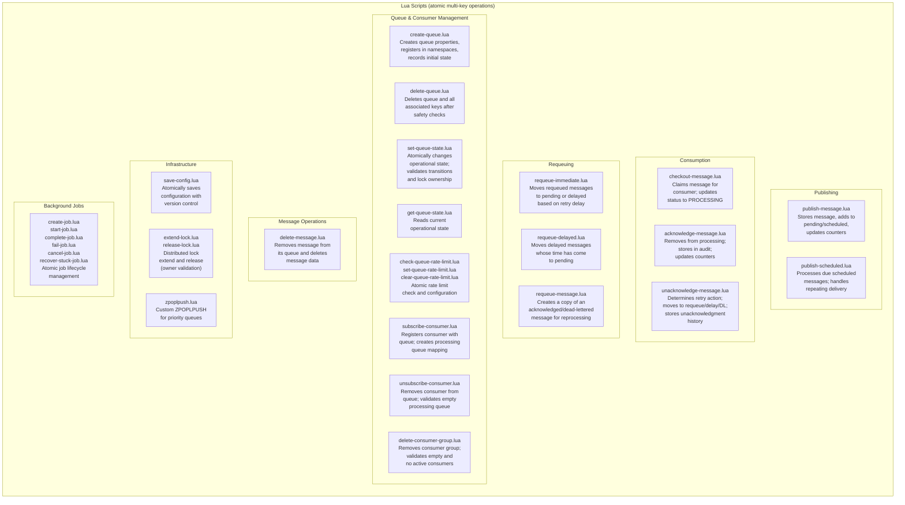

---

## Core Components

### Producers

Producers send messages. A message goes to either a queue directly or through an exchange for routing.

A producer maintains a local cache of Pub/Sub consumer groups to know how many copies of a message to create. The cache is synchronized across instances via events.

### Queues

A queue is a named storage location for messages. Internally, it consists of multiple Redis data structures:

- **Properties** — Queue type, delivery model, rate limit, counters (hash)
- **Pending** — Messages waiting for a consumer (list or sorted set)
- **Processing** — Messages currently being handled (consumer‑specific list)
- **Scheduled** — Messages for future delivery (sorted set)
- **Acknowledged** — Successfully processed messages, if audit enabled (list)
- **Dead-Letter** — Failed messages, if audit enabled (list)
- **Consumers** — Active consumer IDs (hash)
- **Consumer Groups** — Group IDs for Pub/Sub (set)
- **State History** — State transition log (list)

### Exchanges

An exchange routes messages to queues. Three types:

- **Direct** — Exact routing key match. Stores routing keys and per-key queue sets.
- **Topic** — Pattern matching with wildcards. Stores patterns and per-pattern queue sets.
- **Fanout** — Broadcast to all bound queues. Stores a single queue set.

Exchanges are optional. Publishing directly to a queue is faster.

### Consumers

A consumer receives and processes messages. Each consumer:

- Subscribes to one or more queues
- Runs a message handler per queue
- Sends heartbeats to indicate liveness
- Acknowledges or rejects messages

Internally, a consumer has background workers that run only if the consumer acquires a per-queue worker lock:

- **Scheduled Publisher** — Moves due scheduled messages to pending
- **Immediate Requeuer** — Requeues failed messages immediately
- **Delayed Requeuer** — Requeues failed messages after a delay
- **Reaper** — Detects dead consumers and recovers their messages
- **Lock Recoverer** — Unlocks queues stuck in Locked state

The worker lock ensures only one consumer per queue runs these background tasks.

### Managers

Managers provide CRUD operations for queues, messages, exchanges, consumer groups, and configuration. They are stateless — each operation reads from and writes to Redis directly.

---

## Message Flow

### Publishing a Message

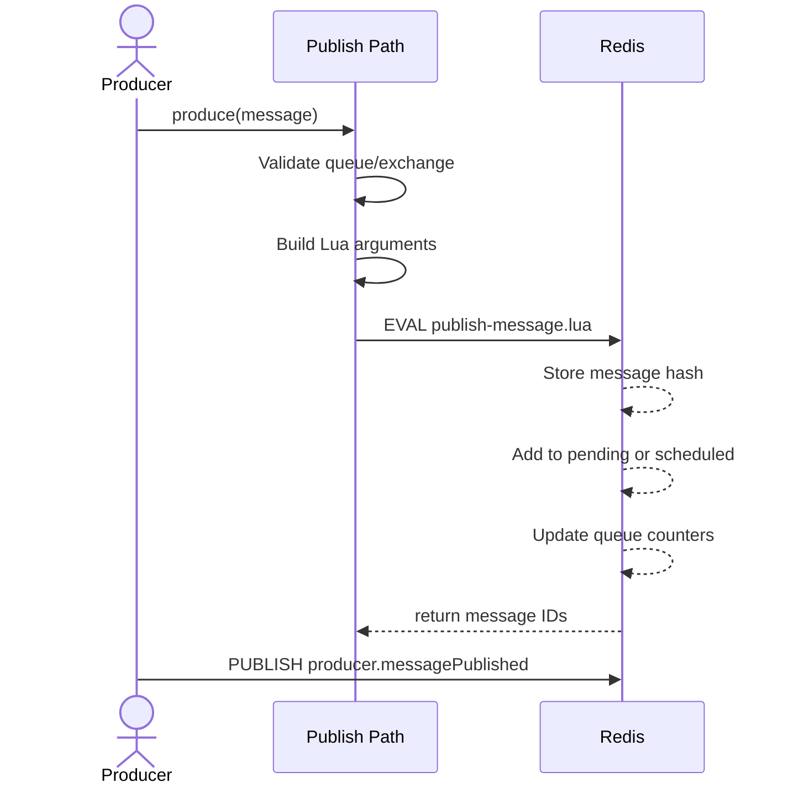

1. The Producer validates the message destination (queue or exchange).
2. It builds the argument list for the Lua script.
3. The Lua script atomically stores the message, adds it to the correct queue, and updates counters.
4. After the script returns, the Producer publishes a `producer.messagePublished` event via the event bus.
5. For Pub/Sub queues, the Producer’s `PubSubTargetResolver` determines how many consumer groups to copy the message to.

### Consuming a Message

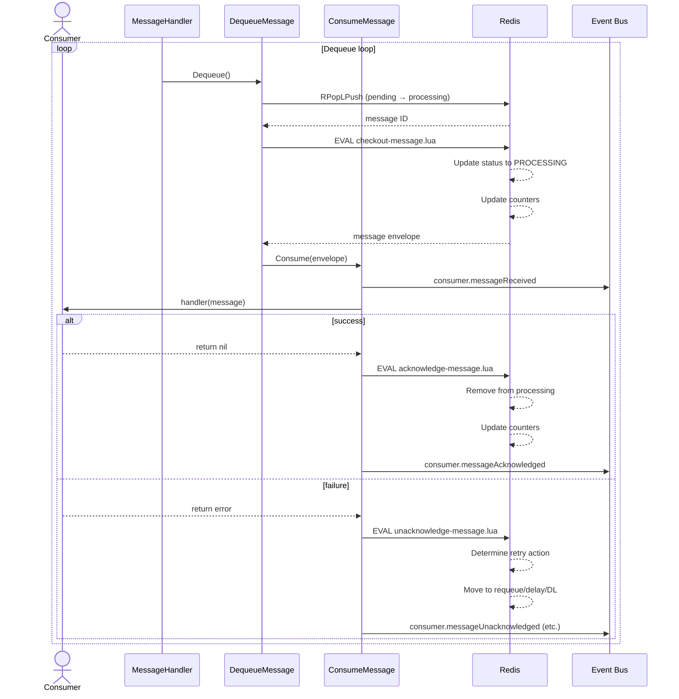

1. The `MessageHandler` loop calls `DequeueMessage`, which atomically moves a message from the pending queue to the consumer’s processing queue (`RPopLPush`).
2. The `checkout‑message.lua` script validates the queue state, claims the message, updates its status to `PROCESSING`, and increments the processing counter.
3. `ConsumeMessage` publishes `consumer.messageReceived` and invokes the user‑supplied handler.
4. **On success:** The message is acknowledged via `acknowledge‑message.lua`, removed from the processing queue, and optionally stored in the acknowledged audit list. A `consumer.messageAcknowledged` event is emitted.
5. **On failure:** The message is unacknowledged via `unacknowledge‑message.lua`. Based on the retry policy, the message is moved to the requeue list, delayed sorted set, or dead‑letter queue. Corresponding events (`consumer.messageUnacknowledged`, `consumer.messageDeadLettered`, `consumer.messageRequeued`, or `consumer.messageDelayed`) are emitted.
6. If the consumer crashes without acknowledging, the **Reaper** (a background worker running on another consumer) detects the dead consumer, recovers the in‑flight message via the same unacknowledge script, and makes it available for another consumer.

### Background Workers (Processing Flow)

Scheduled messages and retried messages are processed by background workers that run inside the consumer after acquiring a per‑queue worker lock.

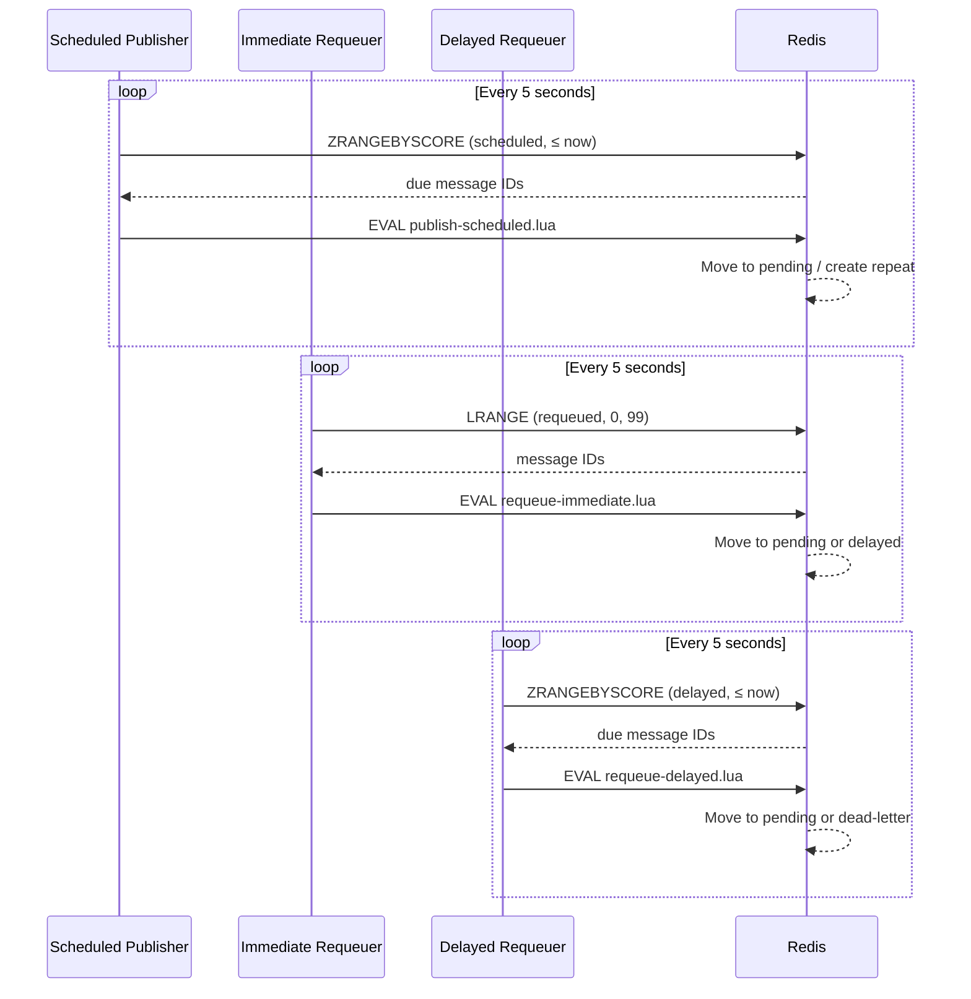

---

## Redis Data Model

All hash fields are indexed by integer keys to ensure cross‑language compatibility.

### Key Schema

All Redis keys follow a consistent hierarchical pattern:

```
redis-smq:{version}:{domain}:{...path components}
```

- **`redis-smq`** — constant prefix for the project.
- **`{version}`** — a numeric version (e.g., `10`) that is incremented when the key schema changes.
- **`{domain}`** — high‑level category (`main`, `ns`, etc.).
- **`{...path components}`** — additional segments joined by the separator (`:`).

> See **[Redis Key Schema](redis-key-schema.md)** for the complete reference of all key patterns and hash field definitions.

### Message Storage

A message is stored as a Redis hash with integer field keys:

| Key | Field name                 | Description                                                          |
|-----|----------------------------|----------------------------------------------------------------------|
| 0   | `id`                       | Unique message identifier (UUID).                                    |
| 1   | `status`                   | Message status (see the status enum in the lifecycle documentation). |
| 2   | `message`                  | Full message payload as a JSON string.                               |
| 3   | `scheduledAt`              | Unix timestamp (ms) when the message is scheduled for delivery.      |
| 4   | `publishedAt`              | Unix timestamp (ms) when the message was first published.            |
| 5   | `processingStartedAt`      | Unix timestamp (ms) when processing started.                         |
| 6   | `deadLetteredAt`           | Unix timestamp (ms) when the message was dead‑lettered.              |
| 7   | `acknowledgedAt`           | Unix timestamp (ms) when the message was acknowledged.               |
| 8   | `unacknowledgedAt`         | Unix timestamp (ms) of the last unacknowledgment.                    |
| 9   | `lastUnacknowledgedAt`     | Unix timestamp (ms) of the previous unacknowledgment.                |
| 10  | `lastScheduledAt`          | Unix timestamp (ms) when the message was last scheduled.             |
| 11  | `lastProcessedAt`          | Unix timestamp (ms) when the message was last processed.             |
| 12  | `requeuedAt`               | Unix timestamp (ms) when the message was first requeued.             |
| 13  | `requeueCount`             | Number of times the message has been requeued.                       |
| 14  | `lastRequeuedAt`           | Unix timestamp (ms) of the most recent requeue.                      |
| 15  | `lastRetriedAttemptAt`     | Unix timestamp (ms) of the last retry attempt.                       |
| 16  | `scheduledCronFired`       | Boolean (0/1) – whether the CRON trigger has fired.                  |
| 17  | `attempts`                 | Number of consumption attempts so far.                               |
| 18  | `scheduledRepeatCount`     | Number of repeat deliveries that have occurred.                      |
| 19  | `expired`                  | Boolean (0/1) – whether the message has expired.                     |
| 20  | `effectiveScheduledDelay`  | Current effective scheduled delay in milliseconds.                   |
| 21  | `scheduledTimes`           | Number of times the message has been scheduled.                      |
| 22  | `scheduledMessageParentId` | ID of the parent scheduled message (for repeat cycles).              |
| 23  | `requeuedMessageParentId`  | ID of the original message that was requeued.                        |

### Queue Properties

Queue metadata is stored as a hash with integer field keys:

| Key | Field name                  | Description                                                           |
|-----|-----------------------------|-----------------------------------------------------------------------|
| 0   | `type`                      | Queue type: 0 = LIFO, 1 = FIFO , 2 = Priority.                        |
| 1   | `rateLimit`                 | Rate limit configuration (JSON). Empty when no limit is set.          |
| 2   | `messagesCount`             | Total number of messages in the queue (all statuses).                 |
| 3   | `deliveryModel`             | 0 = Point‑to‑Point, 1 = Pub/Sub.                                      |
| 4   | `scheduledMessagesCount`    | Number of messages waiting for future delivery.                       |
| 5   | `pendingMessagesCount`      | Number of messages ready to be consumed.                              |
| 6   | `processingMessagesCount`   | Number of messages currently being processed by a consumer.           |
| 7   | `acknowledgedMessagesCount` | Number of successfully processed messages (audit queue).              |
| 8   | `deadLetteredMessagesCount` | Number of permanently failed messages (dead‑letter queue).            |
| 9   | `delayedMessagesCount`      | Number of messages waiting for a retry delay.                         |
| 10  | `requeuedMessagesCount`     | Number of messages waiting to be re‑inserted into the pending queue.  |
| 11  | `operationalState`          | Queue state: 0 = Active, 1 = Paused, 2 = Stopped, 3 = Locked.         |
| 12  | `lastStateChangeAt`         | Unix timestamp (milliseconds) of the last state transition.           |
| 13  | `lockId`                    | Lock identifier when the queue is in the Locked state (empty otherwise).|

### Exchange Properties

| Key | Field name     | Description                                                |
|-----|----------------|------------------------------------------------------------|
| 0   | `type`         | Exchange type: 0 = Direct, 1 = Fanout, 2 = Topic.          |
| 1   | `policy`       | Queue policy: 0 = Standard (FIFO/LIFO), 1 = Priority only. |

### Queue Consumers

A hash mapping consumer ID → JSON string with the following fields:

| Field        | Description                                           |
|--------------|-------------------------------------------------------|
| `ipAddress`  | Array of IP addresses associated with the consumer.   |
| `hostname`   | Hostname of the consumer.                             |
| `pid`        | Process ID.                                           |
| `createdAt`  | Unix timestamp (ms) when the consumer was registered. |

### Queue Processing Queues

A hash mapping a consumer‑specific processing queue key → consumer ID.

Example:
```
ns:my-ns:q:my-queue:cons:consumer123:proc → consumer123
```

### Purge Jobs

A hash mapping job ID → JSON string representing the purge job.

```json
{
  "id": "string (UUID)",
  "payload": {
    "queue": { "name": "string", "ns": "string" },
    "messageType": 0
  },
  "status": 0,
  "createdAt": 0,
  "updatedAt": 0,
  "startedAt": 0,
  "completedAt": 0,
  "batchSize": 1000,
  "delay": 5000,
  "error": "string (empty unless failed)",
  "meta": {
    "purged": 0
  }
}
```

| Field         | Type    | Description                                                                                              |
|---------------|---------|----------------------------------------------------------------------------------------------------------|
| `id`          | string  | Unique job identifier (UUID).                                                                            |
| `payload`     | object  | Contains `queue` (object with `name` and `ns`) and `messageType` (integer matching `EQueueMessageType`). |
| `status`      | integer | Job status: 0 = PENDING, 1 = PROCESSING, 2 = COMPLETED, 3 = FAILED, 4 = CANCELED.                        |
| `createdAt`   | integer | Creation timestamp (Unix milliseconds).                                                                  |
| `updatedAt`   | integer | Last update timestamp.                                                                                   |
| `startedAt`   | integer | When processing started.                                                                                 |
| `completedAt` | integer | When the job finished (success or failure).                                                              |
| `batchSize`   | integer | Number of messages to delete per batch.                                                                  |
| `delay`       | integer | Delay between batches (milliseconds).                                                                    |
| `error`       | string  | Error description if the job failed.                                                                     |
| `meta`        | object  | Contains `purged` (integer) – number of messages successfully purged so far.                             |

---

## Atomicity

All multi‑key operations use Redis Lua scripts. Scripts are loaded at startup (via `SCRIPT LOAD`) and executed by SHA. This ensures:

- No race conditions between concurrent operations
- Consistent state across multiple keys
- Atomic transitions (e.g., pending → processing)

Scripts that modify data validate preconditions (queue state, lock ownership, version matching) and return error codes if conditions are not met.

---

## Cross‑Instance Communication

The event bus uses Redis pub/sub to synchronize state across instances in real time. It is an internal mechanism—not a public API—but external monitors can also subscribe to observe system activity.

**What the event bus synchronizes:**

- **Queue lifecycle** — when a queue is created or deleted, producers that maintain a Pub/Sub consumer group cache are notified so they can start or stop tracking the queue.
- **Queue state changes** — when a queue is paused, resumed, stopped, or locked, consumers are notified so they can stop or start their message handlers accordingly.
- **Consumer group changes** — when a consumer group is created or deleted for a Pub/Sub queue, the producer’s local cache is updated so it knows how many copies of each message to create.
- **Configuration updates** — when configuration is saved, all instances receive the updated settings without needing to restart.

**Characteristics:**

- **Fire‑and‑forget** — events are not persisted. If no subscriber is listening, the event is lost.
- **No delivery guarantees** — there is no acknowledgment or retry mechanism for events.
- **Real‑time only** — subscribers only receive events published after they subscribe. There is no history or replay.
- **Optional** — the event bus is disabled by default. Disabling it reduces Redis load but means that cross‑instance state changes (e.g., queue pausing) will not propagate automatically.

**Recovery from missed events:**

If an instance misses an event (e.g., it was temporarily disconnected), it can rebuild its local state by reading the authoritative data from Redis. For example, a producer can reload its consumer group cache by scanning all Pub/Sub queues. A consumer can check a queue’s current operational state before starting to consume.

> The event bus is complementary to the data stored in Redis. Redis is always the source of truth; the event bus simply makes state changes visible in real time.

---

## Background Workers

### Per-Queue Workers (Consumer)

Acquired via distributed lock. Only one consumer per queue runs these:

- **Scheduled Publisher** — Every 5 seconds, checks for due scheduled messages
- **Immediate Requeuer** — Every 5 seconds, moves requeued messages to pending
- **Delayed Requeuer** — Every 5 seconds, moves delayed messages whose time has come
- **Reaper** — Every 30 seconds, checks for dead consumers and recovers their messages
- **Lock Recoverer** — Every 30 seconds, unlocks queues stuck in Locked state

### Per-Consumer Workers

- **Heartbeat** — Every TTL/3 seconds, updates the consumer's heartbeat key
- **Supervisor** — Every 5 seconds, reconciles message handlers with queue states

---

## Error Handling

RedisSMQ is designed to be resilient to errors at every layer. The approach is consistent across all implementations:

- **Lua scripts** — Return error codes for known conditions (e.g., queue not found, queue locked, invalid state).  Callers translate these codes into typed errors.
- **Error propagation** — Errors are enriched with context at each layer (e.g., operation name, queue name, message ID) to aid debugging.
- **Background workers** — Errors in periodic tasks (scheduler, reaper, etc.) are logged but do not interrupt the worker; the worker continues its next cycle.
- **Event bus** — Operational events (e.g., `consumer.messageDeadLettered`, `consumer.messageUnacknowledged`) allow external monitors to detect and react to failures.

---

## Shutdown Sequence

See [Graceful Shutdown](graceful-shutdown.md) for details.
