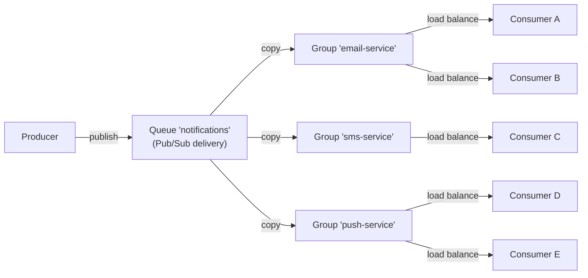

# Consumer Groups

Consumer groups enable the Pub/Sub delivery model where each message is delivered to **every** group, but only to a **single** consumer within each group. They are the core mechanism for broadcasting events to multiple independent services while still allowing each service to scale horizontally.

## How Groups Work

Consider a Pub/Sub queue named `notifications`. Three services need to react to every notification:

- **Email service** – sends an email
- **SMS service** – sends a text message
- **Push service** – sends a push notification

Each service is modelled as a separate consumer group. Within each group, multiple worker instances can run to share the load.

- The producer publishes **one** message.
- The queue delivers a copy to each consumer group.
- Within a group, exactly one consumer receives the message.
- Other consumers in the same group do **not** receive that particular message.

This model allows independent scaling of each service without affecting others.

## Point‑to‑Point vs. Pub/Sub

|                   | Point‑to‑Point              | Pub/Sub                                   |
|-------------------|-----------------------------|-------------------------------------------|
| **Delivery**      | One consumer per message    | Every group per message                   |
| **Groups**        | Not used                    | Required                                  |
| **Load balancing**| Across all consumers        | Within each group                         |
| **Use case**      | Task queues, job processing | Event broadcasting, multi‑service fan‑out |

A queue’s delivery model is set at creation time and cannot be changed later.

## Creating Groups

Consumer groups are created on a queue that has the Pub/Sub delivery model. They can be created:

- **Explicitly** – via the management API before any consumer starts.
- **Implicitly** – when the first consumer subscribes with a specific group ID.
- **Automatically (ephemeral)** – when a consumer subscribes without specifying a group ID.

Groups must exist **before** messages are published; a message sent before a group was created will not be retroactively delivered to that group.

## Ephemeral Groups

If a consumer subscribes to a Pub/Sub queue without providing a group ID, an ephemeral group is created automatically. The group is named `cid-{consumerId}` (where `consumerId` is the unique identifier of the consumer) and is intended for that consumer alone.

Ephemeral groups behave exactly like regular groups but are **deleted automatically** when the consumer shuts down gracefully. They are useful for:

- Temporary consumers that should not leave permanent artifacts.
- Development and testing scenarios.
- Single‑instance services that don’t need manual group management.

If the consumer crashes without a graceful shutdown, the ephemeral group may persist. The reaper (a background worker) will eventually clean up the consumer’s subscriptions, but the empty group will remain until explicitly deleted.

## Managing Groups

The consumer group manager provides the following operations:

- **Save** – Create a new consumer group. Returns a value indicating whether the group was newly created or already existed.
- **List** – Return all group IDs for a given queue.
- **Delete** – Remove a group. The group must be empty (no pending messages) and have no active consumers.

Groups cannot be deleted while they still contain unprocessed messages or have active consumers.

## Consumer Group Lifecycle

1. **Created** – Explicitly or on first subscription. The group ID is added to the queue’s group set.
2. **Active** – One or more consumers are subscribed to the group and processing messages.
3. **Empty** – No consumers are currently subscribed, but the group still exists. New consumers can join later.
4. **Deleted** – Explicitly removed after all messages are processed and consumers are unsubscribed.

## Using Groups with Consumers

A consumer subscribes to a queue and specifies a group ID. If the queue is Pub/Sub, the consumer becomes part of that group and receives messages alongside any other consumers in the same group.

A single consumer can subscribe to **multiple queues** and **multiple groups** across different queues.

### Load Balancing Within a Group

When multiple consumers belong to the same group, the queue distributes messages among them in round‑robin fashion (for FIFO/LIFO queues) or by priority (for priority queues). The distribution is handled atomically by Redis, ensuring that no message is delivered to more than one consumer in the same group.

### Independent Failure Domains

Each group operates independently. If the `sms-service` group fails or its consumers are down, the `email-service` and `push-service` groups are unaffected. The undelivered messages for the `sms-service` group remain in the queue until its consumers resume.

## Best Practices

- **Use meaningful group names** – Name groups after the service or function they represent (e.g., `email-service`, `audit-logger`).
- **Create groups before publishing** – Messages published before a group exists are not retroactively delivered.
- **Monitor group health** – Track which consumers are active in each group. A group with zero consumers will accumulate messages.
- **Clean up unused groups** – Remove groups that are no longer needed to keep the queue metadata tidy.
- **Use ephemeral groups only for short‑lived consumers** – For permanent services, create explicit groups so they survive restarts and crashes.

## Related Pages

- [Queue Delivery Models](queue-delivery-models.md) – Point‑to‑Point vs. Pub/Sub in detail
- [Queues](queues.md) – queue types and properties
- [Consumers](getting-started.md) – how consumers subscribe and process messages
