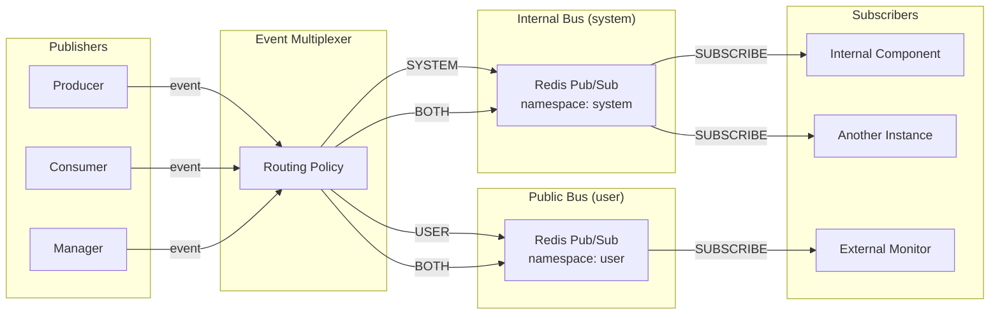

# Event Bus

RedisSMQ uses Redis Pub/Sub to deliver real‑time notifications about system activity. There are **two independent event buses**:

- **Internal Event Bus (system)** – always active, used for cross‑instance synchronisation and internal component communication.
- **Public Event Bus (user)** – optional, intended for external monitoring and integration.

An **event multiplexer** routes each event to one or both buses based on a static routing policy.

## How It Works

Each bus uses a separate Redis Pub/Sub namespace:

```
redis-smq:events:system:*   → Internal bus
redis-smq:events:user:*     → Public bus
```

The channel name is derived from the event name and the bus namespace. For example:

- Internal: `redis-smq:events:system:queue.stateChanged`
- Public: `redis-smq:events:user:queue.queueCreated`



The multiplexer ensures internal events never reach external subscribers unless explicitly routed to the public bus, and public events can be disabled without affecting system synchronisation.

## Characteristics

| Property              | Internal Bus (system)                                      | Public Bus (user)                           |
|-----------------------|------------------------------------------------------------|---------------------------------------------|
| **Purpose**           | Cross‑instance synchronisation, internal component updates | External monitoring and integration         |
| **Activation**        | Always active (required for correct operation)             | Optional – can be enabled/started on demand |
| **Persistence**       | None – events are not stored                               | None                                        |
| **Delivery**          | Fire‑and‑forget, no acknowledgment                         | Fire‑and‑forget                             |
| **History / Replay**  | No                                                         | No                                          |
| **Channel prefix**    | `redis-smq:events:system:`                                 | `redis-smq:events:user:`                    |
| **Wire format**       | JSON array of positional arguments                         | JSON array of positional arguments          |
| **Event routing**     | Depends on routing policy                                  | Depends on routing policy                   |

## Event Routing Policy

The routing policy defines where each event is published. The default targets are:

| Event                         | Target   | Notes                                                       |
|-------------------------------|----------|-------------------------------------------------------------|
| `queue.queueCreated`          | `BOTH`   | Internal cache update + public notification                 |
| `queue.queueDeleted`          | `BOTH`   | Internal cache update + public notification                 |
| `queue.consumerGroupCreated`  | `BOTH`   | Internal cache update + public notification                 |
| `queue.consumerGroupDeleted`  | `BOTH`   | Internal cache update + public notification                 |
| `queue.stateChanged`          | `BOTH`   | Internal consumer reaction + public monitoring              |
| `configuration.updated`       | `SYSTEM` | Only internal – not exposed publicly                        |
| All producer events           | `USER`   | Public only – for external monitoring                       |
| All consumer events           | `USER`   | Public only – for external monitoring                       |

> ⚠️ Producer and consumer events are **not** used for internal synchronisation. They are purely informational and intended for observability.

## Event Payload Format

Events are serialised as a JSON array. Each event has a fixed number of positional arguments whose order and types are documented below.

## Event Reference

### Configuration Events

#### `configuration.updated` – Internal only

Fires when system configuration is saved or updated.

| Argument | Type   | Description                 |
|----------|--------|-----------------------------|
| `config` | object | Full configuration object   |
| `version`| number | Configuration version       |

### Queue Events (routed to BOTH)

#### `queue.queueCreated`

| Argument      | Type   | Description                                                    |
|---------------|--------|----------------------------------------------------------------|
| `queue`       | object | `{ ns: string, name: string }`                                |
| `properties`  | object | Queue properties (type, delivery model, message counts, etc.) |

#### `queue.queueDeleted`

| Argument | Type   | Description                     |
|----------|--------|---------------------------------|
| `queue`   | object | `{ ns: string, name: string }` |

#### `queue.stateChanged`

| Argument      | Type   | Description                                                                                         |
|---------------|--------|-----------------------------------------------------------------------------------------------------|
| `queue`       | object | `{ ns: string, name: string }`                                                                     |
| `transition`  | object | State transition object (`from`, `to`, `reason`, `timestamp`, optional `description`/`lockId`/`lockOwner`) |

#### `queue.consumerGroupCreated`

| Argument     | Type   | Description                     |
|--------------|--------|---------------------------------|
| `queue`      | object | `{ ns: string, name: string }` |
| `groupId`    | string | Consumer group identifier       |

#### `queue.consumerGroupDeleted`

| Argument     | Type   | Description                     |
|--------------|--------|---------------------------------|
| `queue`      | object | `{ ns: string, name: string }` |
| `groupId`    | string | Consumer group identifier       |

### Producer Events (USER only)

#### `producer.up`

| Argument      | Type   | Description |
|---------------|--------|-------------|
| `producerId`  | string | Producer ID |

#### `producer.goingUp`

| Argument      | Type   | Description |
|---------------|--------|-------------|
| `producerId`  | string | Producer ID |

#### `producer.down`

| Argument      | Type   | Description |
|---------------|--------|-------------|
| `producerId`  | string | Producer ID |

#### `producer.goingDown`

| Argument      | Type   | Description |
|---------------|--------|-------------|
| `producerId`  | string | Producer ID |

#### `producer.messagePublished`

| Argument      | Type   | Description                                                |
|---------------|--------|------------------------------------------------------------|
| `messageId`   | string | Published message ID                                       |
| `queue`       | object | `{ ns: string, name: string }` (destination queue)        |
| `producerId`  | string | Producer ID                                                |

### Consumer Events (USER only)

#### `consumer.up`

| Argument      | Type   | Description |
|---------------|--------|-------------|
| `consumerId`  | string | Consumer ID |

#### `consumer.goingUp`

| Argument      | Type   | Description |
|---------------|--------|-------------|
| `consumerId`  | string | Consumer ID |

#### `consumer.down`

| Argument      | Type   | Description |
|---------------|--------|-------------|
| `consumerId`  | string | Consumer ID |

#### `consumer.goingDown`

| Argument      | Type   | Description |
|---------------|--------|-------------|
| `consumerId`  | string | Consumer ID |

#### `consumer.messageReceived`

| Argument      | Type   | Description                     |
|---------------|--------|---------------------------------|
| `messageId`   | string | Message ID                      |
| `queue`       | object | `{ ns: string, name: string }` |
| `consumerId`  | string | Consumer ID                     |

#### `consumer.messageAcknowledged`

| Argument      | Type   | Description                     |
|---------------|--------|---------------------------------|
| `messageId`   | string | Message ID                      |
| `queue`       | object | `{ ns: string, name: string }` |
| `consumerId`  | string | Consumer ID                     |

#### `consumer.messageUnacknowledged`

| Argument      | Type   | Description                     |
|---------------|--------|---------------------------------|
| `messageId`   | string | Message ID                      |
| `queue`       | object | `{ ns: string, name: string }` |
| `consumerId`  | string | Consumer ID                     |
| `cause`       | number | Unacknowledgment cause enum     |

#### `consumer.messageDeadLettered`

| Argument      | Type   | Description                     |
|---------------|--------|---------------------------------|
| `messageId`   | string | Message ID                      |
| `queue`       | object | `{ ns: string, name: string }` |
| `consumerId`  | string | Consumer ID                     |
| `cause`       | number | Dead‑letter cause enum          |

#### `consumer.messageRequeued`

| Argument      | Type   | Description                     |
|---------------|--------|---------------------------------|
| `messageId`   | string | Message ID                      |
| `queue`       | object | `{ ns: string, name: string }` |
| `consumerId`  | string | Consumer ID                     |

#### `consumer.messageDelayed`

| Argument      | Type   | Description                     |
|---------------|--------|---------------------------------|
| `messageId`   | string | Message ID                      |
| `queue`       | object | `{ ns: string, name: string }` |
| `consumerId`  | string | Consumer ID                     |

## Cause Enums

### Unacknowledgment Cause

Used by `consumer.messageUnacknowledged`.

| Value | Name | Description |
|------:|------|-------------|
| 0 | `TIMEOUT` | Message consume timeout exceeded. |
| 1 | `CONSUME_ERROR` | Handler returned an error. |
| 2 | `UNACKNOWLEDGED` | Message explicitly unacknowledged. |
| 3 | `OFFLINE_CONSUMER` | Consumer offline; in‑flight messages recovered. |
| 4 | `SHUTTING_DOWN` | Consumer shut down while processing. |
| 5 | `TTL_EXPIRED` | Message TTL expired. |
| 6 | `QUEUE_STOPPED` | Queue stopped while message in flight. |
| 7 | `QUEUE_INVALID_STATE` | Queue was in invalid state. |
| 8 | `QUEUE_LOCKED` | Queue locked and operation rejected. |
| 9 | `MESSAGE_NOT_FOUND` | Message no longer exists. |
| 10 | `QUEUE_STATE_CHANGED` | Queue state changed during processing. |
| 11 | `QUEUE_NOT_FOUND` | Queue no longer exists. |
| 12 | `UNEXPECTED_ERROR` | Unexpected internal error. |
| 13 | `INVALID_HANDLER_SIGNATURE` | Invalid handler signature. |

### Dead‑Letter Cause

Used by `consumer.messageDeadLettered`.

| Value | Name | Description |
|------:|------|-------------|
| 0 | `TTL_EXPIRED` | Message TTL expired. |
| 1 | `RETRY_THRESHOLD_EXCEEDED` | Message exceeded retry threshold. |
| 2 | `PERIODIC_MESSAGE` | Periodic message (CRON/repeat) was not retried. |

## Subscribing to Events

- Internal components subscribe to the **system bus** (`redis-smq:events:system:*`).
- External monitors and integrations subscribe to the **public user bus** (`redis-smq:events:user:*`).

Language implementations provide typed subscription helpers for the public bus. For example:

```go
// Go example
queueEvents.SubscribeCreated(func(p queueEvents.CreatedPayload) {
    // handle created queue
})
```

```typescript
// TypeScript example
eventBus.on('queue.queueCreated', (queue, properties) => {
    // handle created queue
});
```

The exact API varies by language, but the event names, channel prefixes, and payload formats are identical.

## Best Practices

- Keep event handlers fast; they run synchronously in the subscriber’s event loop.
- Do not rely on events for guaranteed data delivery; use message audit for persistent records.
- Unsubscribe when subscriptions are no longer needed.
- Treat the public bus as optional. If you don’t need external monitoring, you can avoid starting it entirely.
- Never subscribe to the internal system bus from external code; use the public bus for observability.
```

This document is now fully updated for the dual-bus architecture, routing policies, payload format, and cause enums.```markdown
# Event Bus

RedisSMQ uses Redis Pub/Sub to deliver real‑time notifications about system activity. There are **two independent event buses**:

- **Internal Event Bus (system)** – always active, used for cross‑instance synchronisation and internal component communication.
- **Public Event Bus (user)** – optional, intended for external monitoring and integration.

An **event multiplexer** routes each event to one or both buses based on a static routing policy.

## How It Works

Each bus uses a separate Redis Pub/Sub namespace:

```
redis-smq:events:system:*   → Internal bus
redis-smq:events:user:*     → Public bus
```

The channel name is derived from the event name and the bus namespace. For example:

- Internal: `redis-smq:events:system:queue.stateChanged`
- Public: `redis-smq:events:user:queue.queueCreated`


The multiplexer ensures internal events never reach external subscribers unless explicitly routed to the public bus, and public events can be disabled without affecting system synchronisation.

## Characteristics

| Property              | Internal Bus (system)                                      | Public Bus (user)                           |
|-----------------------|------------------------------------------------------------|---------------------------------------------|
| **Purpose**           | Cross‑instance synchronisation, internal component updates | External monitoring and integration         |
| **Activation**        | Always active (required for correct operation)             | Optional – can be enabled/started on demand |
| **Persistence**       | None – events are not stored                               | None                                        |
| **Delivery**          | Fire‑and‑forget, no acknowledgment                         | Fire‑and‑forget                             |
| **History / Replay**  | No                                                         | No                                          |
| **Channel prefix**    | `redis-smq:events:system:`                                 | `redis-smq:events:user:`                    |
| **Wire format**       | JSON array of positional arguments                         | JSON array of positional arguments          |
| **Event routing**     | Depends on routing policy                                  | Depends on routing policy                   |

## Event Routing Policy

The routing policy defines where each event is published. The default targets are:

| Event                         | Target   | Notes                                                       |
|-------------------------------|----------|-------------------------------------------------------------|
| `queue.queueCreated`          | `BOTH`   | Internal cache update + public notification                 |
| `queue.queueDeleted`          | `BOTH`   | Internal cache update + public notification                 |
| `queue.consumerGroupCreated`  | `BOTH`   | Internal cache update + public notification                 |
| `queue.consumerGroupDeleted`  | `BOTH`   | Internal cache update + public notification                 |
| `queue.stateChanged`          | `BOTH`   | Internal consumer reaction + public monitoring              |
| `configuration.updated`       | `SYSTEM` | Only internal – not exposed publicly                        |
| All producer events           | `USER`   | Public only – for external monitoring                       |
| All consumer events           | `USER`   | Public only – for external monitoring                       |

> ⚠️ Producer and consumer events are **not** used for internal synchronisation. They are purely informational and intended for observability.

## Event Payload Format

Events are serialised as a JSON array. Each event has a fixed number of positional arguments whose order and types are documented below.

## Event Reference

### Configuration Events

#### `configuration.updated` – Internal only

Fires when system configuration is saved or updated.

| Argument | Type   | Description                 |
|----------|--------|-----------------------------|
| `config` | object | Full configuration object   |
| `version`| number | Configuration version       |

### Queue Events (routed to BOTH)

#### `queue.queueCreated`

| Argument      | Type   | Description                                                    |
|---------------|--------|----------------------------------------------------------------|
| `queue`       | object | `{ ns: string, name: string }`                                |
| `properties`  | object | Queue properties (type, delivery model, message counts, etc.) |

#### `queue.queueDeleted`

| Argument | Type   | Description                     |
|----------|--------|---------------------------------|
| `queue`   | object | `{ ns: string, name: string }` |

#### `queue.stateChanged`

| Argument      | Type   | Description                                                                                         |
|---------------|--------|-----------------------------------------------------------------------------------------------------|
| `queue`       | object | `{ ns: string, name: string }`                                                                     |
| `transition`  | object | State transition object (`from`, `to`, `reason`, `timestamp`, optional `description`/`lockId`/`lockOwner`) |

#### `queue.consumerGroupCreated`

| Argument     | Type   | Description                     |
|--------------|--------|---------------------------------|
| `queue`      | object | `{ ns: string, name: string }` |
| `groupId`    | string | Consumer group identifier       |

#### `queue.consumerGroupDeleted`

| Argument     | Type   | Description                     |
|--------------|--------|---------------------------------|
| `queue`      | object | `{ ns: string, name: string }` |
| `groupId`    | string | Consumer group identifier       |

### Producer Events (USER only)

#### `producer.up`

| Argument      | Type   | Description |
|---------------|--------|-------------|
| `producerId`  | string | Producer ID |

#### `producer.goingUp`

| Argument      | Type   | Description |
|---------------|--------|-------------|
| `producerId`  | string | Producer ID |

#### `producer.down`

| Argument      | Type   | Description |
|---------------|--------|-------------|
| `producerId`  | string | Producer ID |

#### `producer.goingDown`

| Argument      | Type   | Description |
|---------------|--------|-------------|
| `producerId`  | string | Producer ID |

#### `producer.messagePublished`

| Argument      | Type   | Description                                                |
|---------------|--------|------------------------------------------------------------|
| `messageId`   | string | Published message ID                                       |
| `queue`       | object | `{ ns: string, name: string }` (destination queue)        |
| `producerId`  | string | Producer ID                                                |

### Consumer Events (USER only)

#### `consumer.up`

| Argument      | Type   | Description |
|---------------|--------|-------------|
| `consumerId`  | string | Consumer ID |

#### `consumer.goingUp`

| Argument      | Type   | Description |
|---------------|--------|-------------|
| `consumerId`  | string | Consumer ID |

#### `consumer.down`

| Argument      | Type   | Description |
|---------------|--------|-------------|
| `consumerId`  | string | Consumer ID |

#### `consumer.goingDown`

| Argument      | Type   | Description |
|---------------|--------|-------------|
| `consumerId`  | string | Consumer ID |

#### `consumer.messageReceived`

| Argument      | Type   | Description                     |
|---------------|--------|---------------------------------|
| `messageId`   | string | Message ID                      |
| `queue`       | object | `{ ns: string, name: string }` |
| `consumerId`  | string | Consumer ID                     |

#### `consumer.messageAcknowledged`

| Argument      | Type   | Description                     |
|---------------|--------|---------------------------------|
| `messageId`   | string | Message ID                      |
| `queue`       | object | `{ ns: string, name: string }` |
| `consumerId`  | string | Consumer ID                     |

#### `consumer.messageUnacknowledged`

| Argument      | Type   | Description                     |
|---------------|--------|---------------------------------|
| `messageId`   | string | Message ID                      |
| `queue`       | object | `{ ns: string, name: string }` |
| `consumerId`  | string | Consumer ID                     |
| `cause`       | number | Unacknowledgment cause enum     |

#### `consumer.messageDeadLettered`

| Argument      | Type   | Description                     |
|---------------|--------|---------------------------------|
| `messageId`   | string | Message ID                      |
| `queue`       | object | `{ ns: string, name: string }` |
| `consumerId`  | string | Consumer ID                     |
| `cause`       | number | Dead‑letter cause enum          |

#### `consumer.messageRequeued`

| Argument      | Type   | Description                     |
|---------------|--------|---------------------------------|
| `messageId`   | string | Message ID                      |
| `queue`       | object | `{ ns: string, name: string }` |
| `consumerId`  | string | Consumer ID                     |

#### `consumer.messageDelayed`

| Argument      | Type   | Description                     |
|---------------|--------|---------------------------------|
| `messageId`   | string | Message ID                      |
| `queue`       | object | `{ ns: string, name: string }` |
| `consumerId`  | string | Consumer ID                     |

## Cause Enums

### Unacknowledgment Cause

Used by `consumer.messageUnacknowledged`.

| Value | Name | Description |
|------:|------|-------------|
| 0 | `TIMEOUT` | Message consume timeout exceeded. |
| 1 | `CONSUME_ERROR` | Handler returned an error. |
| 2 | `UNACKNOWLEDGED` | Message explicitly unacknowledged. |
| 3 | `OFFLINE_CONSUMER` | Consumer offline; in‑flight messages recovered. |
| 4 | `SHUTTING_DOWN` | Consumer shut down while processing. |
| 5 | `TTL_EXPIRED` | Message TTL expired. |
| 6 | `QUEUE_STOPPED` | Queue stopped while message in flight. |
| 7 | `QUEUE_INVALID_STATE` | Queue was in invalid state. |
| 8 | `QUEUE_LOCKED` | Queue locked and operation rejected. |
| 9 | `MESSAGE_NOT_FOUND` | Message no longer exists. |
| 10 | `QUEUE_STATE_CHANGED` | Queue state changed during processing. |
| 11 | `QUEUE_NOT_FOUND` | Queue no longer exists. |
| 12 | `UNEXPECTED_ERROR` | Unexpected internal error. |
| 13 | `INVALID_HANDLER_SIGNATURE` | Invalid handler signature. |

### Dead‑Letter Cause

Used by `consumer.messageDeadLettered`.

| Value | Name | Description |
|------:|------|-------------|
| 0 | `TTL_EXPIRED` | Message TTL expired. |
| 1 | `RETRY_THRESHOLD_EXCEEDED` | Message exceeded retry threshold. |
| 2 | `PERIODIC_MESSAGE` | Periodic message (CRON/repeat) was not retried. |

## Subscribing to Events

- Internal components subscribe to the **system bus** (`redis-smq:events:system:*`).
- External monitors and integrations subscribe to the **public user bus** (`redis-smq:events:user:*`).

Language implementations provide typed subscription helpers for the public bus. For example:

```go
// Go example
queueEvents.SubscribeCreated(func(p queueEvents.CreatedPayload) {
    // handle created queue
})
```

```typescript
// TypeScript example
eventBus.on('queue.queueCreated', (queue, properties) => {
    // handle created queue
});
```

The exact API varies by language, but the event names, channel prefixes, and payload formats are identical.

## Best Practices

- Keep event handlers fast; they run synchronously in the subscriber’s event loop.
- Do not rely on events for guaranteed data delivery; use message audit for persistent records.
- Unsubscribe when subscriptions are no longer needed.
- Treat the public bus as optional. If you don’t need external monitoring, you can avoid starting it entirely.
- Never subscribe to the internal system bus from external code; use the public bus for observability.
