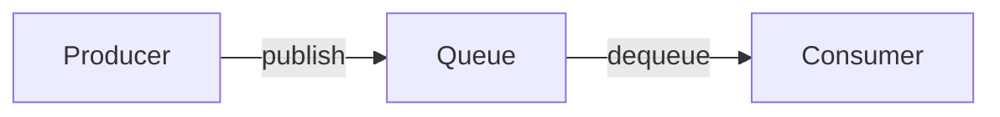
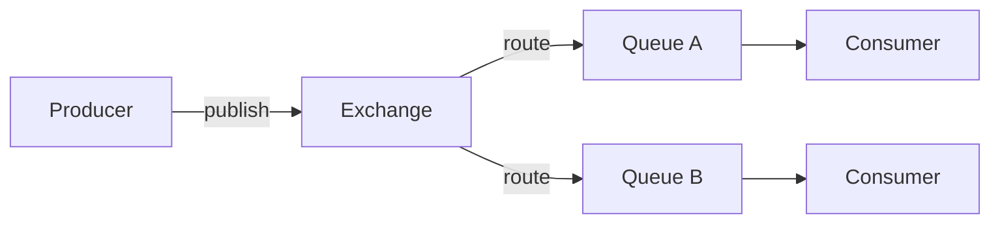

# Getting Started

RedisSMQ is a feature‑rich message queue built on top of Redis. It lets your applications send and receive messages reliably and at high throughput, with built‑in support for scheduling, routing, retries, and more.

## What is RedisSMQ?

At its heart, RedisSMQ is a **message broker** – a piece of infrastructure that decouples **producers** (which create messages) from **consumers** (which process them). Messages wait in durable queues until a consumer is ready to handle them.

The simplest data flow looks like this:

Messages can also be routed through **exchanges** for more complex patterns:

- **Producers** create and send messages.
- **Exchanges** (optional) route messages to one or more queues using rules like exact matches, pattern matching, or broadcast.
- **Queues** store messages until a consumer is ready.
- **Consumers** receive messages and process them.

All data lives inside Redis, which means your messages survive application restarts. The system uses atomic Lua scripts to guarantee consistency.

## Why use RedisSMQ?

RedisSMQ combines the performance of Redis with features you would expect from a full‑blown message queue:

| Capability | What you can do |
|------------|-----------------|
| **Multiple queue types** | FIFO, LIFO, or Priority – choose the ordering that fits your use case. |
| **Flexible routing** | Send directly to a queue or use exchanges (Direct, Topic, Fanout) for advanced routing. |
| **Delivery models** | Point‑to‑Point for work queues; Pub/Sub with consumer groups for broadcasting to multiple services. |
| **Scheduling** | Delay messages, set CRON schedules, or repeat delivery at fixed intervals. |
| **Retries & dead letters** | Automatic retries with configurable backoff. Exhausted messages go to a dead‑letter queue. |
| **Rate limiting** | Throttle consumption per queue to protect downstream services. |
| **Queue state management** | Pause, resume, or stop queues at runtime. |
| **Cross‑language** | Go and TypeScript implementations share the same Redis schema – messages can flow freely between them. |
| **Observability** | Built‑in event bus publishes lifecycle events; message audit stores processing history. |

## Core Concepts

### Messages

A message carries your data and optional delivery instructions:

- **Body** – any JSON‑serializable value.
- **TTL (Time‑to‑Live)** – how long the message remains valid.
- **Priority** – higher values (or lower numbers, depending on queue type) influence delivery order.
- **Retry policy** – maximum attempts and delay between retries.
- **Scheduling** – delay, CRON, or repeat settings.

Once published, a message follows a well‑defined lifecycle, moving through states like `PENDING`, `PROCESSING`, `ACKNOWLEDGED`, or `DEAD_LETTERED`. See [Message Lifecycle](message-lifecycle.md) for the complete flow.

### Queues

A queue holds messages waiting for consumers. Three types are available:

- **FIFO** – first in, first out. Ideal for job processing.
- **LIFO** – last in, first out. Useful when the newest data is most important.
- **Priority** – messages are ordered by a priority level (0‑7). Great for alerts and VIP work.

Queues live inside a **namespace** (logical grouping). The default namespace is `"default"` but you can create as many as you need (e.g., `"production"`, `"staging"`). See [Queues](queues.md) for details.

### Exchanges

Instead of sending directly to a queue, you can publish to an **exchange**, which then routes the message to one or more queues:

- **Direct** – exact routing key match.
- **Topic** – pattern matching with wildcards (`*` and `#`).
- **Fanout** – broadcast to every bound queue.

Exchanges are optional but powerful. They let you add new consumers without changing the producer code. See [Message Exchanges](message-exchanges.md).

### Consumers

A consumer subscribes to a queue and processes messages. After handling a message, the consumer **must** acknowledge success or failure:

- **Acknowledge** – the message is marked as processed and removed from the active queue.
- **Reject / fail** – the message is retried (if retries remain) or dead‑lettered.

Multiple consumers on the same queue automatically share the work. If a consumer crashes, its in‑flight messages are recovered and given to another consumer. See [Message Reliability](message-reliability.md).

## Available Implementations

RedisSMQ is language‑agnostic at the protocol level. The following implementations exist today:

| Language             | Package / Repository                                         |
| -------------------- | ------------------------------------------------------------ |
| TypeScript / Node.js | [redis-smq](https://github.com/weyoss/redis-smq)             |
| Go                   | [go-redis-smq](https://github.com/weyoss/go-redis-smq)       |

All implementations use the same Redis key schema, Lua scripts, and serialisation formats, so you can mix languages freely.

## Next Steps

- [Architecture Overview](architecture.md) – understand the system design and how the components interact.
- [Queues](queues.md) – learn about queue types, namespaces, and properties.
- [Messages](messages.md) – the full message lifecycle and configuration options.
- [Message Exchanges](message-exchanges.md) – when and how to use routing exchanges.
