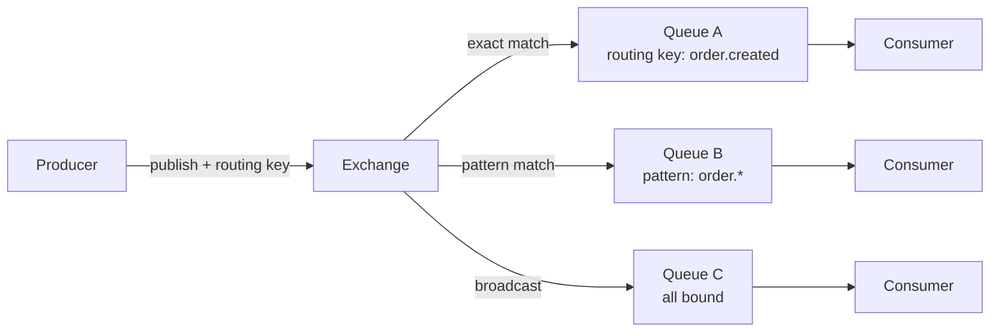

# Message Exchanges

An exchange routes messages from producers to one or more queues. Exchanges are optional — you can send messages directly to a queue for the simplest and fastest path.

## Why use exchanges?

Exchanges decouple producers from specific queues. Instead of hard‑coding a destination queue, a producer sends a message to an exchange with a routing key. The exchange then resolves the binding rules and delivers the message to every matching queue.

## When to Use Exchanges

| Scenario | Recommendation |
|----------|---------------|
| Send to one known queue | Direct to queue (no exchange) |
| Route to different queues based on a key | Direct exchange |
| Route by pattern (e.g., all `order.*` events) | Topic exchange |
| Broadcast to multiple queues | Fanout exchange |

## Exchange Types

### Direct Exchange

Routes messages to queues with an **exact** routing key match. A queue bound with routing key `"order.created"` receives only messages sent with exactly that routing key.

- Multiple queues can be bound to the same routing key.
- Multiple routing keys can point to the same queue.

**Use when:** You know the exact routing keys at bind time and need deterministic routing.

**Examples:**
- `order.created` → order processing queue
- `user.registered` → welcome email queue
- `payment.completed` → invoice generation queue

### Topic Exchange

Routes messages using **pattern matching** with wildcards. Patterns use dot‑separated words and two special symbols:

| Symbol | Matches |
|--------|---------|
| `*` | exactly one word |
| `#` | zero or more words |

**Pattern examples:**

| Pattern | Matches | Does not match |
|---------|---------|----------------|
| `order.*` | `order.created`, `order.cancelled` | `order`, `order.items.added` |
| `order.#` | `order.created`, `order.items.added` | `user.created` |
| `#` | everything | — |
| `*.created` | `order.created`, `user.created` | `order.items.created` |

**Use when:** You need flexible, pattern‑based routing where queues subscribe to categories of events.

### Fanout Exchange

Broadcasts every message to **all** bound queues. No routing key is used. Every queue bound to the exchange receives every message.

**Use when:** You need all bound queues to receive every message — notifications, alerts, system‑wide events.

**Example:** A monitoring system publishes an alert to a fanout exchange. All notification channels (email, SMS, push) are bound to it and receive every alert.

## Exchange Policy

Each exchange has a policy that restricts which queue types can bind to it. This ensures message format compatibility — all queues bound to the same exchange must accept the same message format.

| Policy | Allowed Queue Types | Description |
|--------|---------------------|-------------|
| **Standard** | FIFO, LIFO | For ordered message delivery |
| **Priority** | Priority | For priority‑based message delivery |

A message published to an exchange is routed to all bound queues. If the exchange had mixed queue types, a message with a priority would be invalid for FIFO queues, and a message without a priority would be invalid for priority queues. The policy prevents this mismatch at bind time.

**Policy violations return an error at bind time** — not at publish time. This means you catch configuration errors early.

## Direct to Queue (No Exchange)

The fastest delivery path. The producer specifies the target queue directly. No routing, no exchange lookup, no policy checks.

Use this when:
- The destination queue is known at publish time
- No routing flexibility is needed
- Maximum throughput is desired

## Binding Queues to Exchanges

A **binding** connects a queue to an exchange.

- **Direct exchanges** require a routing key.
- **Topic exchanges** require a binding pattern.
- **Fanout exchanges** require no key — all bound queues receive all messages.

> **Auto‑creation:** Exchanges are automatically created the first time a queue is bound to them. You do not need to create an exchange explicitly before binding queues.

**Namespace restriction:** Queues and exchanges must be in the same namespace. Cross‑namespace bindings are rejected.

## Managing Exchanges

- **Create** — Explicitly create an exchange with a type and policy (optional, auto‑created on bind).
- **Bind** — Connect a queue to an exchange with a routing key/pattern.
- **Unbind** — Remove a queue binding.
- **Delete** — Remove an exchange (must have no bound queues).
- **List** — View all exchanges, by namespace, or by queue.

## Performance

Direct-to-queue is fastest. Among exchanges:
- Direct exchange is fastest (exact string match).
- Topic exchange has pattern‑matching overhead.
- Fanout exchange multiplies work by the number of bound queues.

See [Performance](performance.md) for details.

## Example: Complete Exchange Flow

1. Create queues (FIFO for orders, Priority for alerts).
2. Bind queues to exchanges with routing keys/patterns.
3. Producer publishes to exchange with routing key.
4. Exchange resolves matching queues.
5. Messages delivered to all matched queues.
6. Consumers process messages from their queues.
