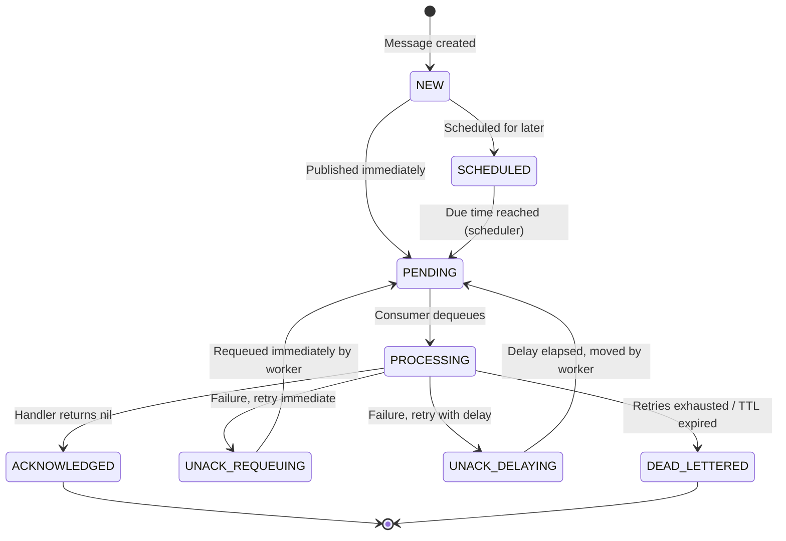
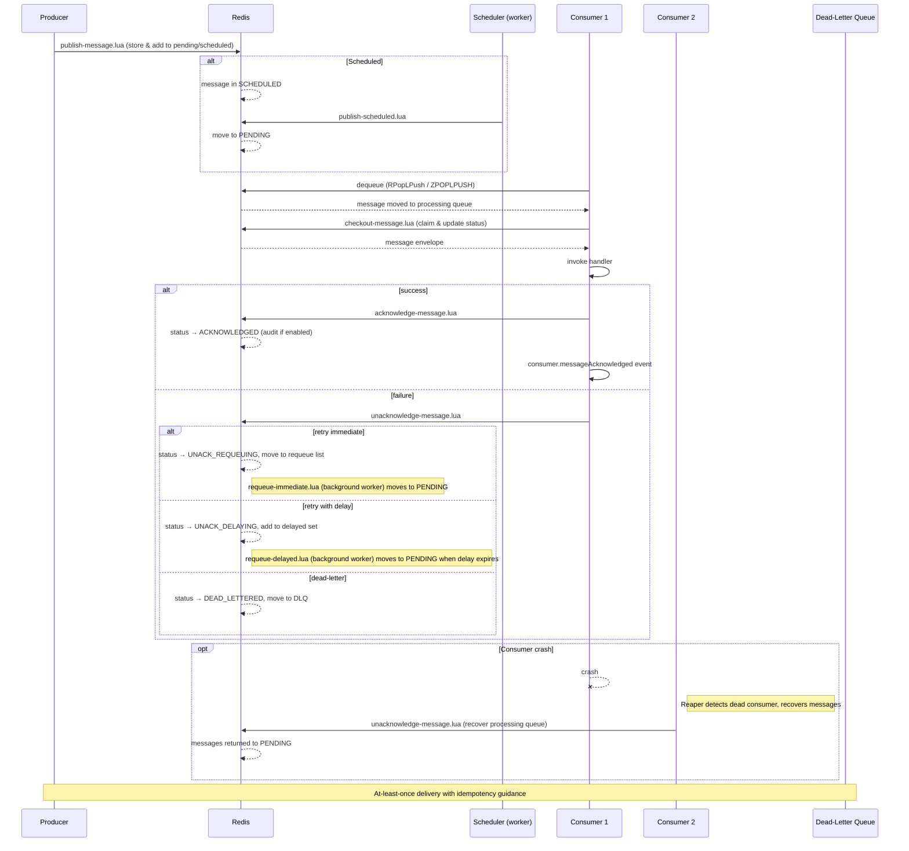

# Message Lifecycle

A message in RedisSMQ goes through several states from creation to final resolution.

## Status Enum

| State             | Description                                                                                     |
|-------------------|-------------------------------------------------------------------------------------------------|
| `NEW`             | Message has been created but not yet published to the queue.                                    |
| `PENDING`         | Message is waiting to be consumed.                                                              |
| `PROCESSING`      | Message is currently being processed by a consumer.                                             |
| `SCHEDULED`       | Message is scheduled to be delivered at a later time (delay, CRON, or repeat).                  |
| `ACKNOWLEDGED`    | Message has been successfully consumed and acknowledged.                                        |
| `UNACK_REQUEUING` | Message has been unacknowledged and is waiting in the requeue list to be moved back to pending. |
| `UNACK_DELAYING`  | Message has been unacknowledged and is waiting in the delayed queue for a scheduled retry.      |
| `DEAD_LETTERED`   | Message has failed processing and has been moved to the dead‑letter queue.                      |

> ℹ️ `UNACK_REQUEUING` and `UNACK_DELAYING` are **internal intermediate states** that exist while the message is being moved between queues by background workers.

## State Diagram

## Complete Lifecycle Walkthrough

The following sequence diagram illustrates every stage of a message's journey, from production to final resolution. Reliability mechanisms are active at each step.

## Key Concepts

### Expiry (TTL)
If a message has a time‑to‑live, it will be dead‑lettered (or discarded) when the TTL expires, regardless of its current state.

### Retry Policy
- **Retry Threshold** – maximum number of consumption attempts before the message is dead‑lettered.
- **Retry Delay** – time to wait between retry attempts.

### Consumption Timeout
If a consumer does not acknowledge a message within the configured timeout, the message is assumed failed and returned to the queue for another consumer.

### Periodic Messages
Messages with CRON expressions or repeat counts are never retried on failure—they are immediately dead‑lettered. The next scheduled instance will be delivered as usual.

### Crash Recovery
If a consumer crashes without acknowledging, the **Reaper** (a background worker running on another consumer) detects the dead consumer, recovers the in‑flight message via the same unacknowledge script, and makes it available for another consumer.

## Related Pages

- [Messages](messages.md) – message properties and configuration
- [Scheduling Messages](scheduling-messages.md) – delays, CRON, and repeating delivery
- [Message Reliability](message-reliability.md) – delivery guarantees and recovery
- [Message Audit](message-audit.md) – tracking processed messages
