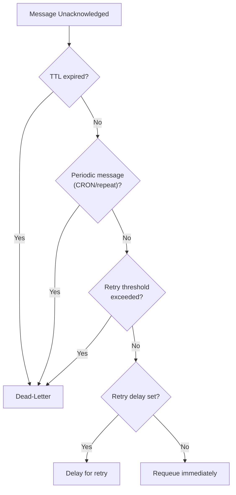
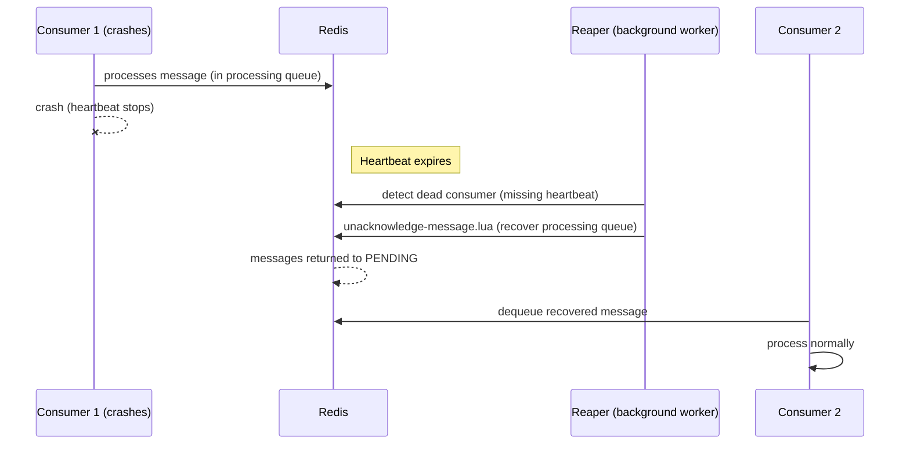
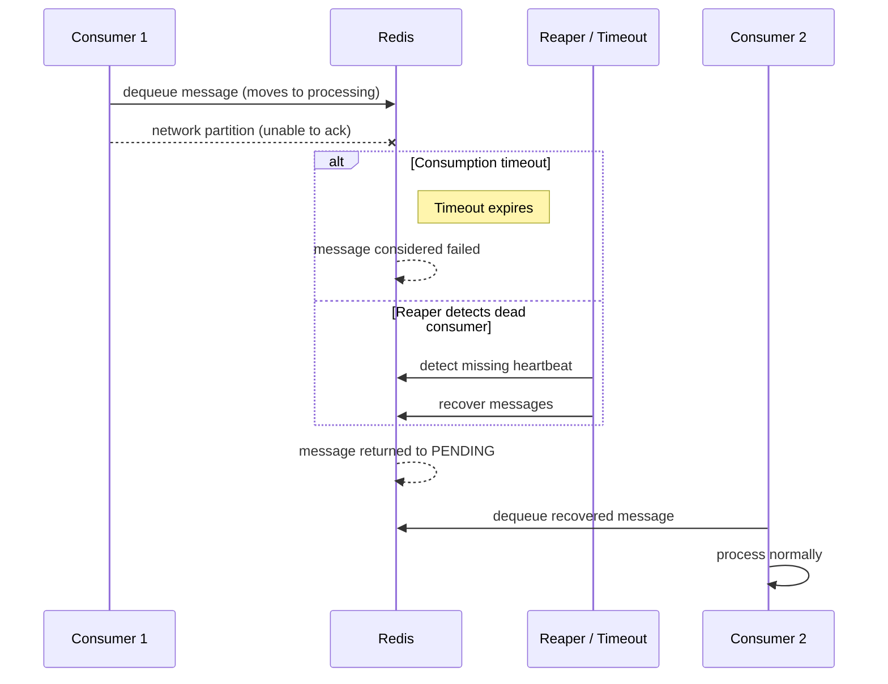
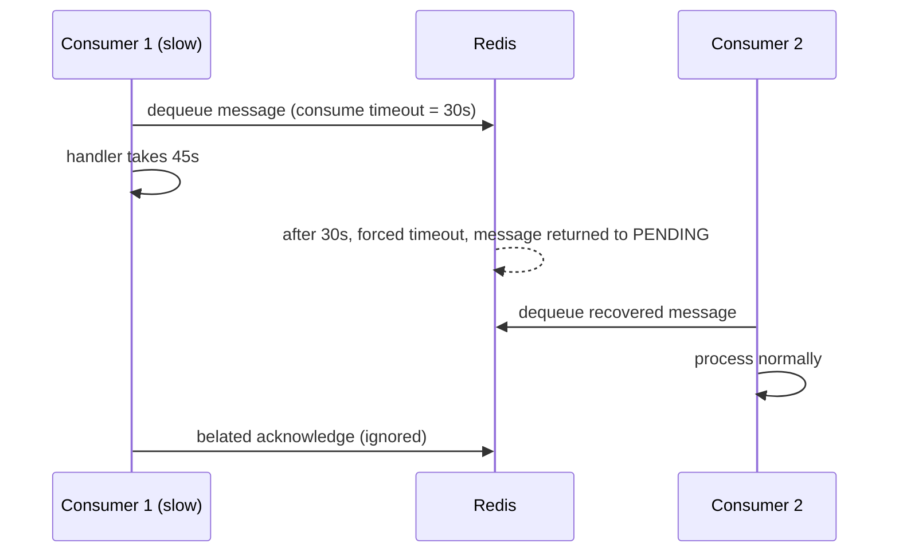

# Message Reliability

RedisSMQ guarantees **at-least-once** delivery. Messages are persisted in Redis and survive acknowledgements; they are only removed when explicitly deleted. Unacknowledged messages (in‑flight, scheduled, or pending) are automatically recovered after consumer failures.

## How Reliability Works

### Message Persistence

Messages are stored as a Redis hash (`main:msg:{id}`) immediately upon publication and are **never automatically deleted** by RedisSMQ. After a message is acknowledged or dead‑lettered, its status is updated and it may be recorded in an audit list (if audit is enabled), but the original message data remains in Redis. To free storage, messages must be explicitly deleted using the message management API.

Because the message hash persists, you can always retrieve the full message details – payload, timestamps, retry history – even after the message has been processed.

In failure scenarios (consumer crash, network partition), **unacknowledged** messages that are still in the processing queue are automatically recovered and returned to the pending queue. This guarantees that no in‑flight message is ever lost.

### Acknowledgment Protocol

Consumers must explicitly acknowledge each message after processing:

- **Success** — The message is marked as processed and removed from the active queue.
- **Failure** — The message is returned for retry or moved to the dead-letter queue.

If a consumer crashes before acknowledging, the message remains in the processing queue.

### Consumer Heartbeats

Each consumer sends periodic heartbeats to Redis. If heartbeats stop, the consumer is considered dead. A background worker detects dead consumers and recovers their in-flight messages, returning them to the pending queue for other consumers to process.

### Consumption Timeout

Each message can have a maximum processing time. If a consumer does not acknowledge within this time, the message is assumed failed and returned to the queue. This prevents a slow or stuck consumer from holding messages indefinitely.

## Retry Policy

When a message fails, it can be retried:

- **Retry Threshold** — Maximum number of attempts before giving up.
- **Retry Delay** — Time to wait between retries.

After the threshold is exceeded, the message is moved to the dead-letter queue.

### Retry Decision Logic

When a message is unacknowledged, the system determines the next action based on the following flowchart:

The steps are:

1. **TTL expired** → Dead-letter immediately (never retried)
2. **Periodic message** (CRON/repeat) → Dead-letter immediately (the next scheduled copy will be delivered)
3. **Retry threshold exceeded** → Dead-letter
4. **Retry delay set** → Schedule for delayed retry
5. **Otherwise** → Requeue immediately

## Dead-Letter Queue

Messages that cannot be processed after all retries are moved to the dead-letter queue. Dead-lettered messages are stored for inspection if message audit is enabled. They can be inspected and requeued manually.

## Recovery Scenarios

### Consumer Crash

1. Consumer processes message.
2. Consumer crashes.
3. Heartbeat stops.
4. Reaper detects dead consumer.
5. In-flight messages returned to pending queue.
6. Other consumers pick them up.

### Network Partition

1. Consumer loses Redis connection.
2. Can't send acknowledgment.
3. Consumption timeout expires **or** reaper detects dead consumer.
4. Message returned to pending queue.
5. Other consumers pick it up.

### Slow Processing

1. Message has consume timeout of 30 seconds.
2. Handler takes 45 seconds.
3. At 30 seconds, message considered failed.
4. Message returned to pending queue.
5. Another consumer picks it up.
6. Original handler eventually finishes — acknowledgment is ignored.

## Idempotency

Because messages can be delivered more than once in failure scenarios, message handlers should be **idempotent** — processing the same message multiple times should produce the same result.

Strategies for idempotency:

- Track processed message IDs in a database.
- Use unique business keys in the message body.
- Design operations to be repeatable (e.g., "set value to X" not "increment by 1").

## Batch Operations

For performance, acknowledgments and unacknowledgments can be batched. Batching groups multiple operations into a single Redis command, reducing network overhead while maintaining reliability guarantees.

Each batch is flushed when:
- The batch size limit is reached.
- A configurable timeout expires.
- The consumer shuts down (all pending operations are flushed).
