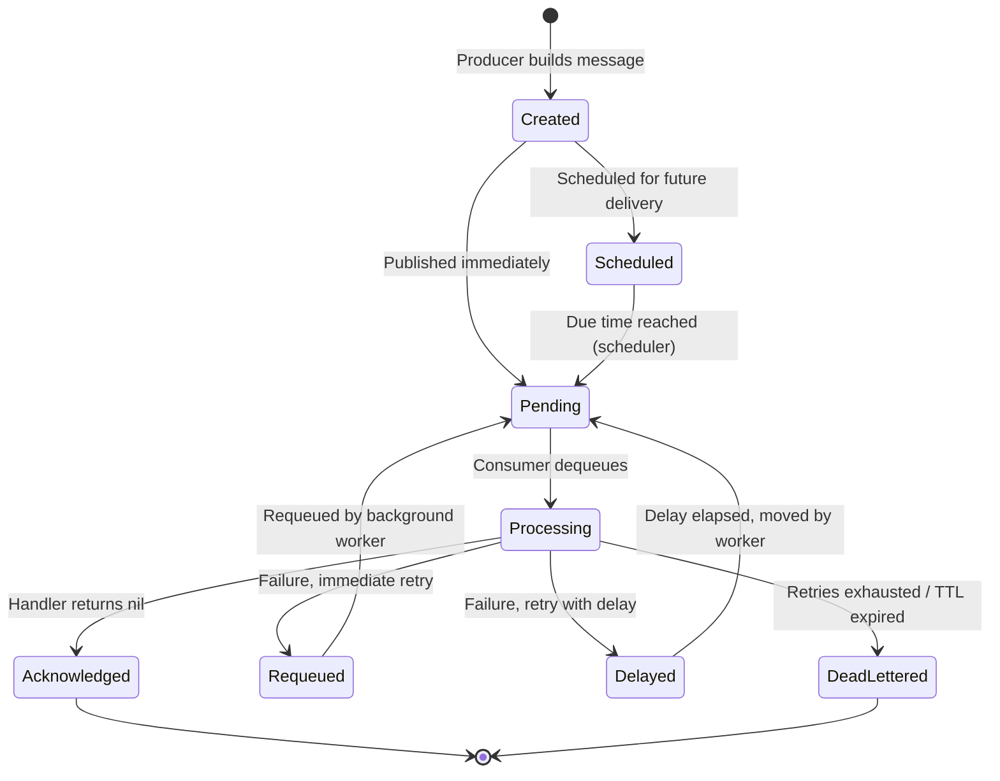

# Messages

A message is the unit of data that flows through RedisSMQ. It contains a payload and delivery instructions. Every message is identified by a unique ID (UUID) and is persisted in Redis until explicitly deleted.

## Message Lifecycle

The message’s status transitions are managed atomically by Lua scripts.  
For a more detailed walkthrough and a complete state diagram, see [Message Lifecycle](message-lifecycle.md).

### Key Points

- **Scheduled messages** – stored in a sorted set ordered by delivery timestamp. A background scheduler moves them to pending at the right time.
- **Message data persists** – even after acknowledgement or dead‑lettering, the message hash remains in Redis. It must be explicitly deleted (via the message management API) to free storage.
- **At‑least‑once delivery** – messages are never lost; unacknowledged messages are automatically recovered after consumer failures.

## Message Properties

### Body

The payload. Any JSON‑serializable value: strings, numbers, objects, arrays.

### TTL (Time to Live)

How long a message can exist before it expires. Expired messages are moved to the dead‑letter queue if audit is enabled, or discarded. Set to `0` for no expiration.

### Priority

The priority level (0–7) for priority queues. Lower numbers are higher priority. Only effective when the target queue is a priority queue.

### Retry Policy

- **Retry Threshold** – Maximum number of retry attempts before dead‑lettering.
- **Retry Delay** – Time to wait between retries.

### Consumption Timeout

Maximum time a consumer has to process the message. If the consumer does not acknowledge within this time, the message is returned to the queue for another consumer.

### Scheduling

Messages can be scheduled for future delivery:

- **Delay** – Deliver after a fixed time offset.
- **CRON** – Deliver on a calendar schedule.
- **Repeat** – Deliver multiple times at a fixed interval.

See [Scheduling Messages](scheduling-messages.md) for details.

## Delivery Destinations

Every message must specify a destination. Choose one:

- **Direct to Queue** – The message goes to a specific queue. Fastest option.
- **Via Exchange** – The message goes to an exchange, which routes it to one or more queues based on routing rules.

See [Message Exchanges](message-exchanges.md) for details.

## Acknowledgment

After processing, a consumer must acknowledge the message:

- **Success** – The message is marked as acknowledged and removed from the processing queue. Its data remains in Redis for later inspection (unless deleted).
- **Failure** – The message is returned to the queue for retry (if retries remain) or dead‑lettered.

This explicit acknowledgment ensures messages are never lost due to consumer crashes – if a consumer dies before acknowledging, the message is automatically recovered.

## Message Audit

When enabled, processed messages are stored for inspection:

- **Acknowledged Messages** – Successfully processed messages.
- **Dead‑Lettered Messages** – Messages that failed permanently.
- **Unacknowledgment History** – A timeline of failure events per message.

See [Message Audit](message-audit.md) for details.
