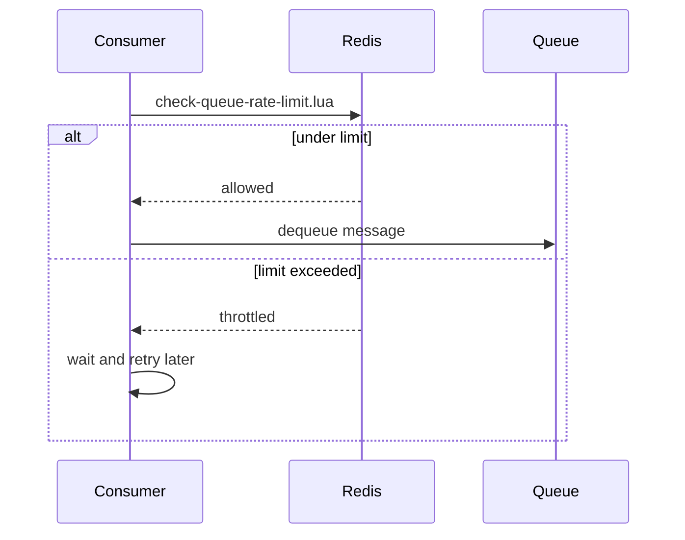

# Queue Rate Limiting

Rate limiting controls how many messages a queue delivers per time interval. It protects downstream services from being overwhelmed by limiting the rate at which consumers can pick up messages.

## How It Works

A rate limit defines a maximum number of messages that can be dequeued within a sliding time window. The limit is enforced **per queue**, and the check happens atomically just before a consumer attempts to dequeue a message.

The rate limit check is performed by a dedicated Lua script (`check‑queue‑rate‑limit.lua`). This script atomically:

1. Initialises a counter with the configured limit if the window does not exist.
2. Decrements the counter for each allowed request.
3. Returns whether the request is allowed or throttled.

This atomic guarantee means that even under high concurrency, the rate limit is enforced correctly – no request can slip through.

**Example:** A rate limit of `100` messages with an interval of `60` seconds means that at most 100 messages will be delivered from that queue in any 60‑second window. If consumers try to dequeue faster, they will receive a throttled response and must wait before trying again.

## Setting Rate Limits

Rate limits are configured per queue and can be changed at any time without restarting consumers.

A rate limit has two parameters:

- **Limit** – Maximum number of messages allowed in the interval (must be > 0).
- **Interval** – The sliding window duration (minimum 1 second).

### Examples

| Scenario | Limit | Interval | Description |
|----------|-------|----------|-------------|
| Throttle a CPU‑heavy worker | 10 | 1 second | Max 10 messages per second |
| Respect a third‑party API | 100 | 1 minute | Max 100 requests per minute |
| Smooth batch processing | 500 | 5 seconds | Burst of 500, then wait |

Once a rate limit is set, it applies to all consumers of that queue. The same limit is shared across all consumer instances.

## Retrieving and Clearing Rate Limits

You can inspect the current rate limit configuration of a queue. If no limit is set, the response indicates that there is no active throttling.

Clearing a rate limit removes the restriction entirely. The queue immediately returns to unlimited delivery.

## Interaction with Queue State

- Rate limiting is **enforced only when the queue is in the Active state**. If the queue is paused or stopped, no messages are delivered regardless of the rate limit.
- Changing or clearing a rate limit requires the queue to not be in the **Locked** state. This prevents conflicts with maintenance operations like queue purging.

## Performance Considerations

Rate limiting adds a single Redis Lua script call (`EVALSHA`) before each dequeue attempt. This is extremely fast and the overhead is negligible compared to the cost of message processing or network latency. The counter key is automatically expired after the interval, so there is no persistent storage growth.

When rate limiting is not configured, there is zero overhead – the check is simply skipped.

## Use Cases

- **Protect external APIs** – Stay within rate limits imposed by third‑party services.
- **Control resource usage** – Limit CPU‑ or memory‑intensive message processing.
- **Smooth traffic bursts** – Prevent sudden spikes from overwhelming downstream systems.
- **Fair scheduling** – Ensure multiple queues share limited resources equitably.

## Related Pages

- [Queues](queues.md) – queue types and delivery models
- [Queue State Management](queue-state-management.md) – pausing, stopping, and resuming queues
- [Performance](performance.md) – overall throughput characteristics
