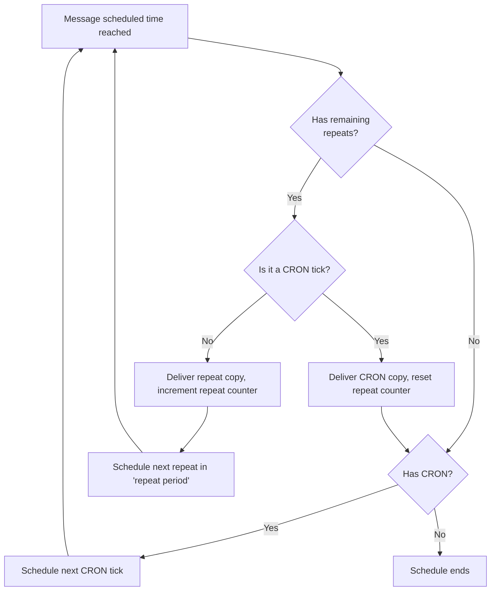
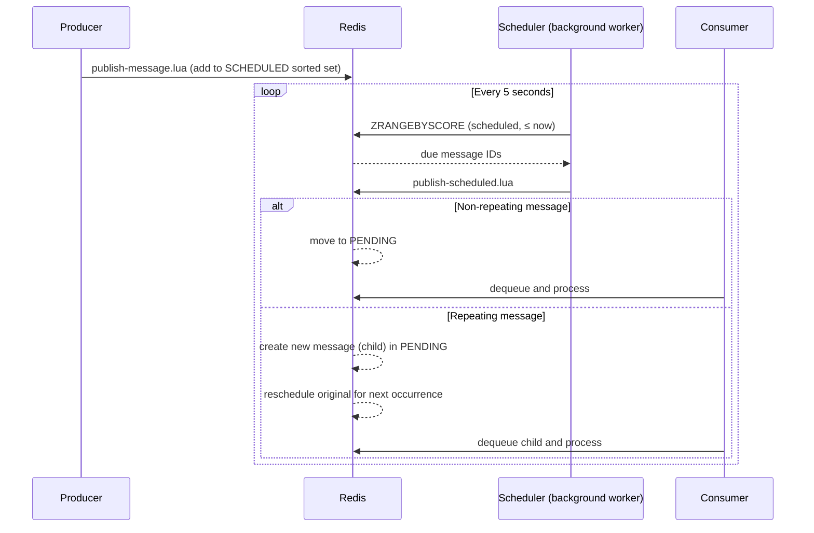

# Scheduling Messages

Messages can be scheduled for future delivery. RedisSMQ supports one‑time delays, calendar‑based CRON schedules, and repeating delivery. A background scheduler (running inside every active consumer) periodically moves due messages from the scheduled queue to the pending queue.

## Scheduling Types

### Delayed Delivery

A message is held until a specified time offset has passed, then delivered **once**.

```
Publish → Wait (delay) → Deliver → Processed
```

**Use for:** deferred tasks, rate‑limited notifications, follow‑up reminders.

### CRON Scheduling

A message is delivered according to a CRON expression. Each time the CRON schedule fires, a **copy** of the message is delivered.

```
Publish → CRON schedule → Deliver → Repeat on next CRON tick
```

**Use for:** daily reports, weekly maintenance jobs, calendar‑based triggers.

CRON expressions use the standard **6‑field** format (seconds are configurable):

```
┌───────────── second (0–59)
│ ┌───────────── minute (0–59)
│ │ ┌───────────── hour (0–23)
│ │ │ ┌───────────── day of month (1–31)
│ │ │ │ ┌───────────── month (1–12, or JAN–DEC)
│ │ │ │ │ ┌───────────── day of week (1–7, or SUN–SAT, where 1 = Sunday)
│ │ │ │ │ │
* * * * * *
```

All six fields are required when specifying a CRON expression.

### Repeating Delivery

A message is delivered **multiple times** at a fixed interval. Can be combined with an initial delay or a CRON schedule.

```
Publish → Wait (delay) → Deliver → Wait (period) → Deliver → … → Done
```

**Use for:** periodic health checks, polling tasks, heartbeat signals.

- A repeat count of `0` means **indefinite**.
- The repeat period is the time between deliveries.

## Combining Scheduling Options

All three options can be combined. The order of evaluation for each delivery is:

1. **Delay** – If set, the message waits for the delay before its first delivery.  
2. **CRON** – If set, it controls the delivery cadence. Within a CRON cycle, repeats use the repeat period.  
3. **Repeat** – If set, the message is delivered multiple times.



**How to read the diagram:**

- Every time a scheduled message becomes due, the system checks repeats first.
- **If repeats remain:**
    - On a CRON tick, a CRON copy is delivered and the repeat counter resets.
    - Between CRON ticks, repeat copies are delivered at the configured period.
- **If repeats are exhausted (or there is no repeat):**
    - With a CRON, the next CRON tick is scheduled.
    - Without a CRON, the schedule ends.

This reflects the actual logic in the scheduler, where `NextScheduledTimestamp()` gives priority to delays, then picks the earlier of the next CRON tick or the next repeat delivery, resetting or incrementing the repeat counter as appropriate.

| Combination              | Behaviour                                                       |
|--------------------------|-----------------------------------------------------------------|
| **Delay only**           | Deliver once after the delay.                                   |
| **Repeat only**          | First delivery immediately, then repeatedly every period.       |
| **Delay + Repeat**       | First delivery after the delay, then repeatedly every period.   |
| **CRON only**            | Deliver at each CRON tick indefinitely.                         |
| **CRON + Repeat**        | Deliver at each CRON tick; between ticks, repeat every period.  |
| **CRON + Delay + Repeat**| Delay first, then follow CRON+Repeat logic.                     |

## Scheduled Message Lifecycle



- The scheduler runs every 5 seconds.
- Up to 99 messages are processed per tick.
- Repeating messages are rescheduled atomically: a new child message is created for the current delivery, and the original is updated for the next tick.

## Managing Scheduled Messages

Scheduled messages can be inspected and cancelled before delivery:

- **Browse** – List all scheduled messages for a queue.
- **Delete** – Remove a scheduled message by ID to prevent delivery.
- **Purge** – Remove all scheduled messages via a background purge job.

A scheduled message that has been delivered becomes a regular pending message. It can then be acknowledged, retried, etc., but cannot be “un‑delivered” – you must delete it if you no longer want it.

## Important Notes

- Scheduled messages are stored in a **sorted set** ordered by delivery timestamp.
- The scheduler is a background worker inside every consumer that holds the queue’s worker lock.
- Scheduling works with **all queue types** (FIFO, LIFO, Priority) and both delivery models (Point‑to‑Point, Pub/Sub).
- CRON expressions are validated at set time; **invalid expressions are silently ignored** (the message is published as an immediate, non‑scheduled message).
- Repeating messages that fail are **dead‑lettered immediately** (they are not retried). The next scheduled instance is delivered as usual.

## Related Pages

- [Messages](messages.md) – message properties and configuration
- [Message Lifecycle](message-lifecycle.md) – complete state diagram
- [Message Reliability](message-reliability.md) – delivery guarantees and recovery
